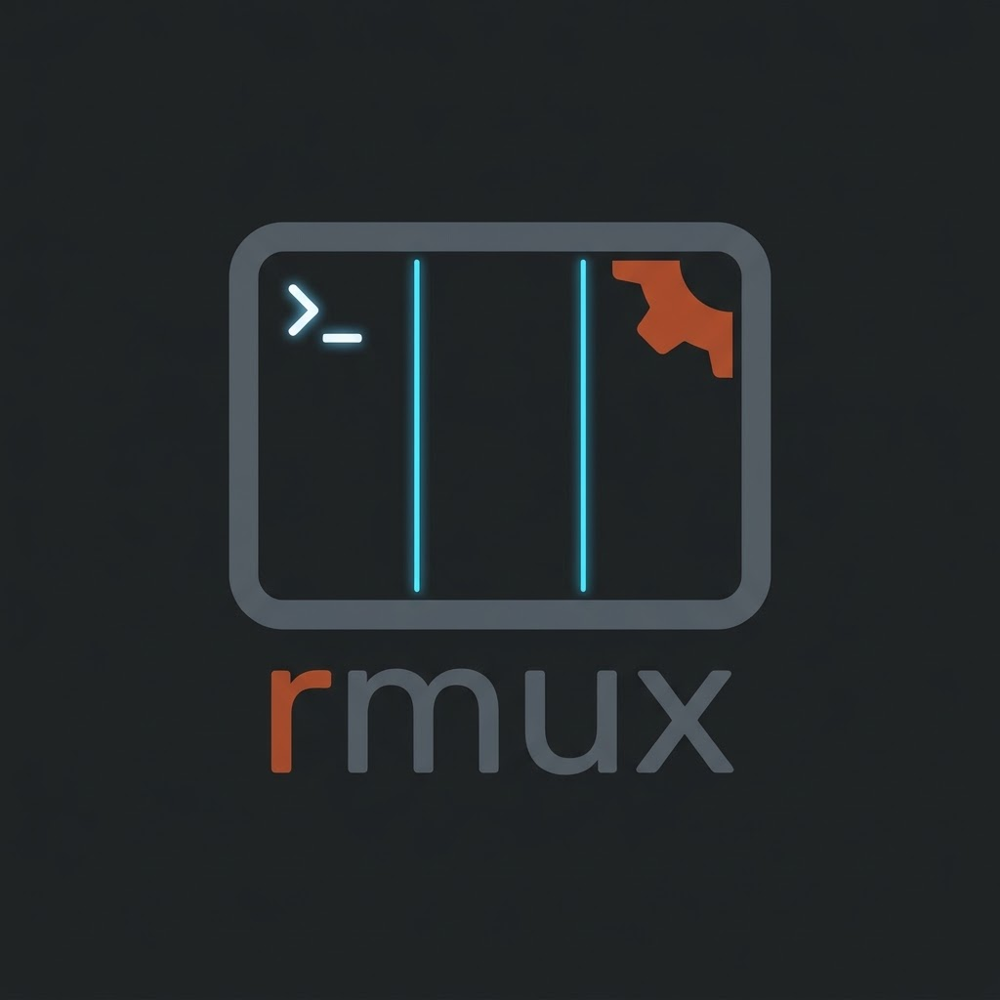
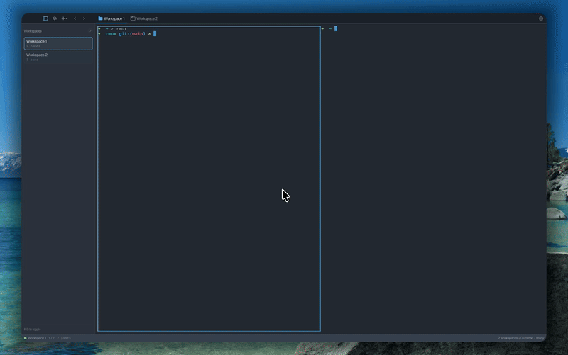

<div align="center">



# rmux

**Cross-platform terminal multiplexer GUI written in Rust.**

rmux is a memory-efficient terminal multiplexer with a native desktop interface. It supports workspaces, pane splits, browser panes, notifications, and a socket API for automation.

Targets Linux, macOS, and Windows.

[](https://github.com/nakulbh/rmux/actions/workflows/ci.yml)
[](#license)

</div>

---

## Demo

<div align="center">


</div>

## Features

- Multi-workspace terminal sessions
- Horizontal and vertical pane splits with focus navigation
- Keyboard-first navigation
- Browser split support (wry-backed webview panes)
- Notification panel and desktop notifications (OSC 9/99/777)
- Unix socket API + CLI client for scripting

## Quick Start

```sh
# Build
cargo build --workspace

# Run
cargo run -p rmux-app --bin rmux
```

## Verify

```sh
cargo fmt --all -- --check
cargo clippy --workspace --all-targets -- -D warnings
cargo test --workspace
```

## Keyboard Shortcuts

macOS uses Cmd where Linux and Windows use Ctrl.

| Action | macOS | Linux/Windows |
|---|---|---|
| New Workspace | Cmd+N | Ctrl+N |
| Split Right | Cmd+D | Ctrl+D |
| Split Down | Cmd+Shift+D | Ctrl+Shift+D |
| Close Pane | Cmd+W | Ctrl+W |
| Toggle Sidebar | Cmd+B | Ctrl+B |
| Find | Cmd+F | Ctrl+F |

See [`docs/KEY_BINDINGS.md`](docs/KEY_BINDINGS.md) for the full reference.

## Project Layout

| Path | Purpose |
|---|---|
| `crates/rmux-app` | Main egui application |
| `crates/rmux-terminal` | Terminal emulation (alacritty_terminal + portable-pty) |
| `crates/rmux-cli` | CLI client |
| `crates/rmux-api` | Socket server (JSON-RPC) |
| `crates/rmux-config` | Configuration schema |

See [`docs/PLAN.md`](docs/PLAN.md) for the roadmap and [`AGENTS.md`](AGENTS.md) for contribution guidelines.

## License

MIT
